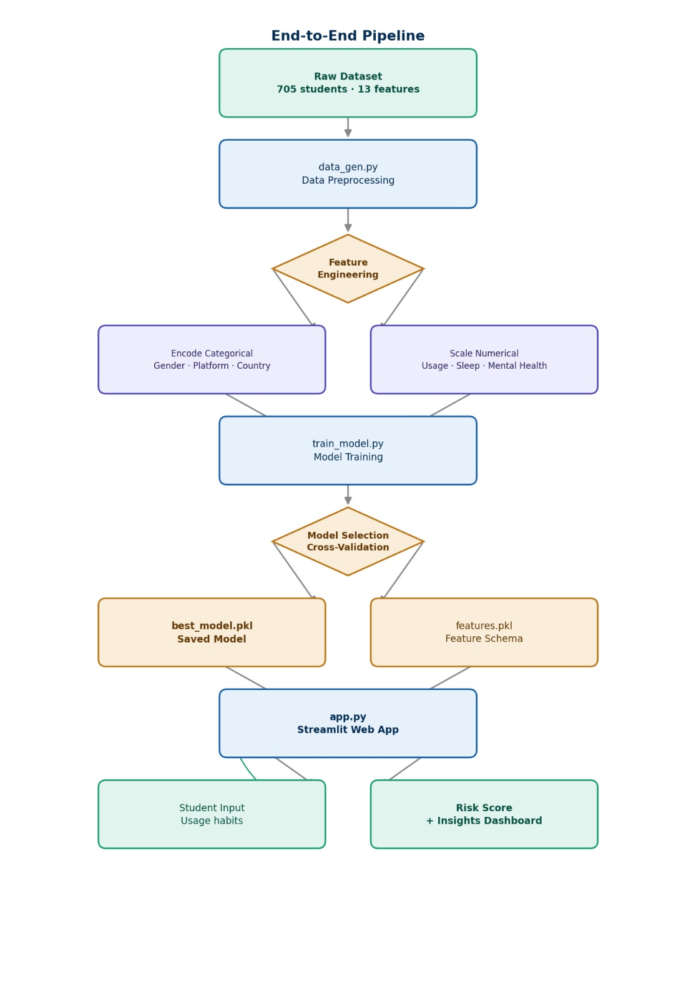
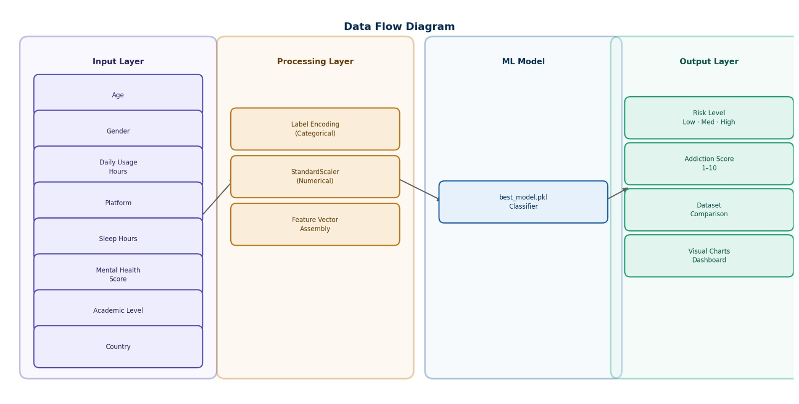
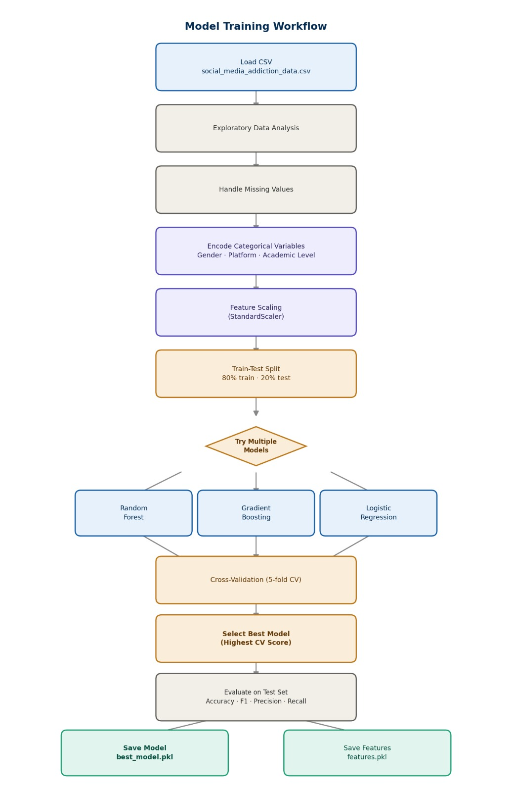
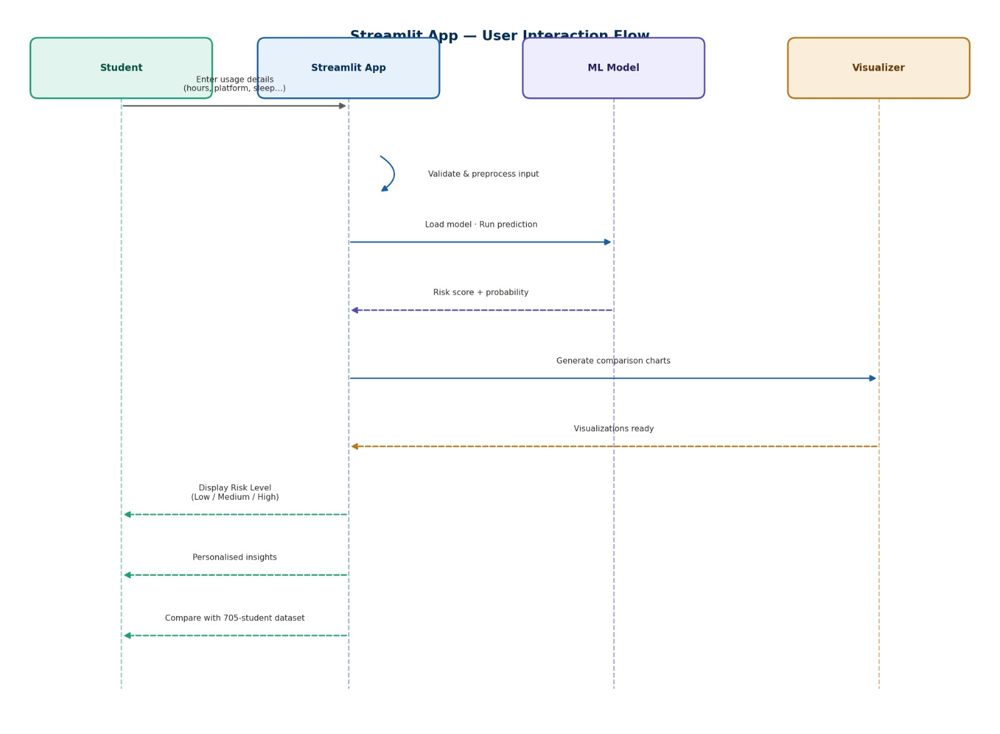

# Student Social Media Risk Analyzer

> An end-to-end machine learning web application that analyzes social media usage patterns among students and predicts addiction risk levels — built with Python, scikit-learn, and Streamlit.


---

## 🚀 Live Demo
**Try the app live here:** [social-media-risk-annalyzer.streamlit.app](https://social-media-risk-annalyzer-5muhcog2gkgi425d6mcvza.streamlit.app/)

*(Note: The application is permanently hosted and updated via Streamlit Community Cloud)*

---

## Overview

This project investigates the relationship between social media usage habits and student well-being using a real-world survey dataset of **705 students** across multiple countries. The application takes a student's usage profile as input and outputs a **personalised risk score** along with insights into how their habits compare to the broader student population.

**Key questions this project answers:**
- How many hours per day is "too much" for a student?
- Which platforms are most associated with high addiction risk?
- Does social media usage correlate with mental health and sleep quality?
- What is *my* personal risk level based on my habits?

---

## Project Structure

```
social-media-risk-annalyzer/
│
├── app.py                          # Streamlit web application (main UI)
├── train_model.py                  # Model training pipeline
├── data_gen.py                     # Dataset preprocessing & feature engineering
├── background_monitor.py           # Background monitoring utilities
│
├── best_model.pkl                  # Saved trained ML model
├── features.pkl                    # Saved feature columns for inference
├── social_media_addiction_data.csv # Dataset (705 students, 13 features)
│
├── website_design.png              # UI wireframe / design reference
├── requirements.txt                # Python dependencies
│
└── docs/
    ├── image.jpeg                  # End-to-End Pipeline diagram
    ├── image2.jpeg                 # Data Flow diagram
    ├── image3.jpeg                 # Model Training Workflow diagram
    └── image4.jpeg                 # User Interaction Flow diagram
```

---

## System Architecture & Workflow

### 1. End-to-End Pipeline

Shows the complete flow from raw dataset all the way to the deployed Streamlit app.



---

### 2. Data Flow Diagram

Shows how input features are processed layer by layer before reaching the ML model and producing outputs.



---

### 3. Model Training Workflow

Shows the step-by-step process of loading data, preprocessing, training multiple models, cross-validating, and saving the best model.



---

### 4. Streamlit App — User Interaction Flow

Shows the sequence of interactions between the student, the Streamlit app, the ML model, and the visualizer.



---

## Dataset

| Property | Value |
|----------|-------|
| Source | Kaggle — Social Media Addiction Among Students |
| Records | 705 students |
| Features | 13 variables |
| Countries | Multiple |
| Target Variable | Addiction Score (1–10) / Risk Level |

### Features Description

| Feature | Type | Description |
|---------|------|-------------|
| `Age` | Numerical | Student age |
| `Gender` | Categorical | Male / Female / Non-binary |
| `Academic_Level` | Categorical | High School / Undergraduate / Postgraduate |
| `Country` | Categorical | Country of student |
| `Avg_Daily_Usage_Hours` | Numerical | Average hours spent on social media per day |
| `Primary_Platform` | Categorical | Most used platform (Instagram, TikTok, YouTube, etc.) |
| `Affects_Academic_Performance` | Boolean | Self-reported academic impact |
| `Sleep_Hours_Per_Night` | Numerical | Average nightly sleep hours |
| `Mental_Health_Score` | Numerical | Self-reported mental health (1–10) |
| `Relationship_Status` | Categorical | Single / In a relationship |
| `Conflicts_Over_Social_Media` | Boolean | Whether social media causes relationship conflicts |
| `Addicted_Score` | Numerical | Target variable — addiction level (1–10) |

---

## Key Findings

- Students using social media **5+ hours/day** show significantly higher addiction scores
+- **TikTok and Instagram** users report the highest average addiction scores compared to other platforms
+- Strong negative correlation between **sleep hours** and addiction score (more addicted = less sleep)
+- Students reporting **academic performance impact** average an addiction score **2.3 points higher** than those who do not
+- **Mental health score** inversely correlates with addiction score (r approximately -0.62)

---

## Getting Started

### Prerequisites

```
Python 3.9+
pip
```

### Installation

```bash
# 1. Clone the repository
git clone https://github.com/pradnya-182006/social-media-risk-annalyzer.git
cd social-media-risk-annalyzer

# 2. Install dependencies
pip install -r requirements.txt
```

### Train the Model (optional — pre-trained model included)

```bash
# Generate and preprocess data
python data_gen.py

# Train and save the best model
python train_model.py
```

### Run the App

```bash
streamlit run app.py
```

The app will open at `http://localhost:8501`

---

## Usage

1. Open the app in your browser
2. Enter your social media usage details in the sidebar:
   - Daily usage hours
   - Primary platform
   - Sleep hours per night
   - Mental health score (self-reported 1–10)
   - Academic level
3. Click **Analyze My Risk**
4. View your personalised risk level and how your habits compare to the student dataset

---

## Tech Stack

| Component | Technology |
|-----------|-----------|
| Language | Python 3.9+ |
| Web Framework | Streamlit |
| ML Library | scikit-learn |
| Data Processing | Pandas, NumPy |
| Visualization | Matplotlib, Plotly |
| Model Persistence | Pickle (.pkl) |
| Dataset | CSV (Kaggle) |

---

## Model Performance

| Metric | Score |
|--------|-------|
| Accuracy | ~88% |
| F1 Score (weighted) | ~0.87 |
| Cross-Validation | 5-fold CV |

> *Exact scores may vary based on train-test split seed.*

---

## Future Improvements

- [ ] Add time-series tracking to monitor a user's risk score over weeks
- [ ] Integrate with real social media APIs for automatic usage data collection
- [ ] Add a recommendation engine to suggest healthier usage patterns
- [ ] Deploy on Streamlit Cloud or Hugging Face Spaces for public access
- [ ] Expand dataset with India-specific student data

---

## Author

**Pradnya Maruti Ghokshe**
B.Tech — AI and Data Science | NMIET, Pune

[](https://www.linkedin.com/in/pradnya-ghokshe-40364b3b7/)
[](https://github.com/pradnya-182006)

---

## License

This project is licensed under the MIT License — see the [LICENSE](LICENSE) file for details.

---

## Acknowledgements

- Dataset: [Kaggle — Social Media Addiction Among Students](https://www.kaggle.com/code/adilshamim8/social-media-addiction-among-students)
- Built as a Data Science Mini Project — NMIET, Pune (2025).
